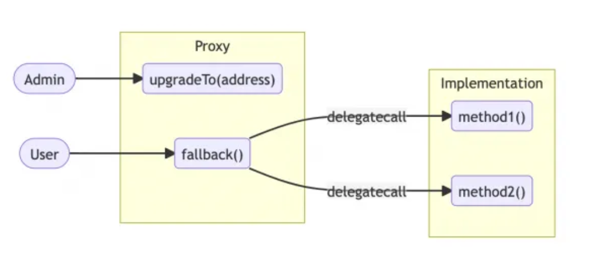
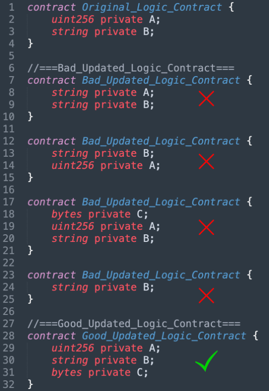
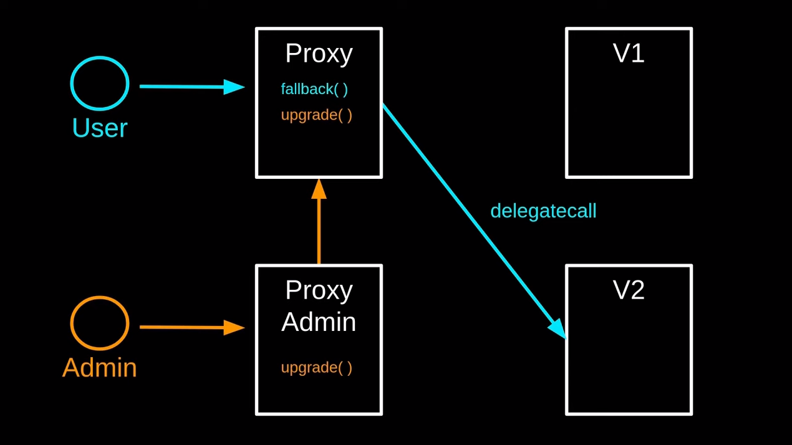

# Upgrading Smart Contracts

## Introduction

**Welcome to this learning session!**

We will deep dive into Solidity Proxy contracts. You will learn more about how they works, the potential security problems and then you will implement & upgrade your own Proxy contract.

_Good luck and have fun!_


## What is a smart contract upgrade?

In the context of smart contracts, upgrading refers to the process of modifying the functionality of an existing smart contract while preserving its state and history. Upgrading can be necessary to fix bugs, improve performance, add new features, or adapt to changing requirements without disrupting the existing users or data on the blockchain.

A smart contract upgrade refers to the process of modifying the functionality of an existing smart contract while preserving its state and transaction history. Smart contract upgrades are crucial for maintaining and improving decentralized applications over time.

In the world of blockchain and smart contracts, the concept of upgrading smart contracts is crucial for maintaining the longevity and adaptability of decentralized applications (dApps). Smart contract upgrades allow developers to improve and fix their applications over time without actions from existing users or modifications of the data stored on the blockchain.

- **Security & Bug Fixes:** Like any software application, smart contracts can have bugs or vulnerabilities. Upgrading a smart contract allows developers to fix these issues, ensuring that the application operates securely and reliably.

- **Evolution & Improvements:** Use cases and requirements can evolve over time, upgrading smart contracts allows developers to add new features or modify existing ones to meet these changing needs.

- **Gas Cost & Performance:** As the number of users and transactions on a blockchain network grows gas costs grows too, and the efficiency and scalability of smart contracts become more and more important. Upgrades can optimize contract code, leading to better performance and reduced gas costs.

- **Compatibility & Flexibility:** As the blockchain technology evolves constantly, new standards may emerge. Smart contract upgrades enable the integration of these new standards to keep the application up-to-date and interoperable with other projects.

All this points increases the longevity and sustainability of smart contracts, this is why upgrading is important. However, it don't comes without drawbacks:

- **Centralization Risks:** Depending on the admin key mechanism used, the control over the upgrade process could become centralized. This goes against the decentralized nature of blockchain networks and may raise concerns about censorship or misuse of power as lot of money can be involve.

- **Loss of Immutability:** Immutability, one of the core principles of blockchain technology, will be compromised with upgrades. In facts, smart contract upgrades involve changing the contract's code or state, so in 10 years your application will surely not works the same as now. You will have to check which version of the code you actually use or rely on owner(s) of the contract to not modify badly the contract. As immutability and decentralization are important in Blockchain ecosystem, some users may resist modify that property.

- **Security Risks with Upgrading Mechanisms:** The process of upgrading itself can introduce security risks. If not implemented correctly, malicious actors may exploit upgrade mechanisms to compromise the integrity of the application.

In this section, we will explore some smart contract upgrades with their pros and cons and how to use them in pratice with a training.

## Proxy Pattern

The Proxy Pattern can have different sub-patterns, but it always follow the same logic: the separation between the logic code and the data stored. Then instead of 1 you have 2 different contracts, the Proxy contract that keep the data state, that users will always call and that is never modify. And the implementation contract, or logic contract, that keep the code logic and can be change.

Both contracts are linked through a `delegatecall`. This is an opcode that allow a contract to execute the code of another contract in his own context. So we can use the code of the implementation contract and stay in the context and the state of the Proxy contract.

The `delegatecall` is trigger in the `fallback()` function of the Proxy contract. The `fallback()` function is a function that is automatically executed in a contract when a user calls a function that doesn't exist. With this property, the Proxy contract can redirect the user call to the code logic of the implementation and execute it in his own context with `delegatecall`.

Then you have an `upgradeTo()` function that allow to switch from an implementation contract to another and upgrade your dapp.



The Proxy Pattern has a lot of advantages, but it comes with some drawbacks you need to have in mind. One of these is the new security concerns due to the augmentations of the complexity. Some of them are well known such as the Storage Collision and the Function Clashes. Let's deep dive into them:

#### Storage Collision

Storage collision is an issue that you have to be careful with because it can lead to data corruption or overriding during upgrades.

In Solidity variables are stored in slots. You can whether choose the slot where you want to store your variable or, if nothing is set, Solidity will increment the slot in the storage starting from index 0 by your variable declaration order.

When you modify a variable, Solidity will modify the slot corresponding to your variable. So with `delegatecall`, if the implementation contract logic modify the variable of his slot 1, it will modify the variable in the slot 1 of the Proxy contract whatever the variable is. So you have to be sure that slots are corresponding between your Proxy and your Implementation contracts.

If they not correspond it can lead to Storage collision such as that:

```
        |Proxy                     |Implementation           |
        |--------------------------|-------------------------|
Slot 0  |address _implementation   |address _owner           | <=== Storage collision!
Slot 1  |...                       |mapping _balances        |
Slot 2  |                          |uint256 _supply          |
...     |                          |...                      |
```

You can see that variables in slot 0 did not correspond.

The `_implementation` variable you see in the Proxy, is the variable that store the current Implementation contract address. It is mandatory to link both contracts and being able to delegate call but as you see it leads to storage collision in this case.

The solution used by the Proxy patterns is to store the `_implementation` address at a random slot in order to avoid this storage collision:

```
        |Proxy                     |Implementation           |
        |--------------------------|-------------------------|
Slot 0  |...                       |address _owner           |
Slot 1  |...                       |mapping _balances        |
Slot 2  |...                       |uint256 _supply          |
...     |...                       |...                      |
        |...                       |                         |
        |...                       |                         |
        |...                       |                         |
...     |...                       |                         |
Slot n  |address _implementation   |                         | <=== Randomized slot.
...     |...                       |                         |
        |...                       |                         |
```

With this method storage collision is no longer a problem between Proxy and Implementation.

However, the main risk is during an upgrade because your new implementation contract can also cause this storage collision if you add a new variable that use the slot of a previous one:

```
        |Implementation_v0   |Implementation_v1        |
        |--------------------|-------------------------|
Slot 0  |address _owner      |address _lastContributor | <=== Storage collision!
Slot 1  |mapping _balances   |address _owner           |
Slot 2  |uint256 _supply     |mapping _balances        |
Slot 3  |...                 |uint256 _supply          |
...     |                    |...                      |
```

As you can see here, the new variable in the new implementation is in slot 0, so the previous variables are no longer in the same slot which is causing a storage collision.

It means that when you want to proceed to an upgrade, you have to be very careful of how you store your variable in the new implementation in order to avoid storage collision and corruption or loss of your datas.

If you want to add new variables during your upgrade, you can proceed like that:

```
        |Implementation_v0   |Implementation_v1        |
        |--------------------|-------------------------|
Slot 0  |address _owner      |address _owner           |
Slot 1  |mapping _balances   |mapping _balances        |
Slot 2  |uint256 _supply     |uint256 _supply          |
Slot 3  |...                 |address _lastContributor | <=== Storage extension.
        |                    |...                      |
```

Now Storage are both compatible and the new implementation will not corrupt our Proxy datas. To choose the order of storing for your variables, remember that Solidity store them in their order of declaration. So you just have to declare the new variables after the old ones. Another good practice is to inherits from your last implementation in your new one when it's possible. It will then avoid these storage collision problems and still be retroactive with the old logic contract.

Here is an example of how you can add a new variable in your Solidity contract:



#### Constructor

In a Proxy Pattern you must not create a `constructor()` function in your implementation contract. This is because constructors are functions that can be executed only once at the deployment. So it is executed in the context of the implementation contract but not in the context of the Proxy contract (which is the valuable one for the state). Moreover, if several proxies use the same implementation they couldn't each use the `constructor()` function neither.

To keep the benefice of a constructor in a Proxy pattern, you can choose which function you want to be use as constructor in the context of the Proxy during the deployment. We will see how it works later in the training.

---

### Setup

For this training, my node and yarn versions are `node: v19.7.0` & `yarn: 1.22.19`.

To get started with the Proxy Pattern, go to `learn-proxy-contracts/upgrades/proxy` in your terminal and install dependencies:

```
yarn install
```

Then create a copy of the environment file:

```
cp .env.example .env
```

### Transparent Proxy Pattern

The Transparent Proxy Pattern is a variant of the Proxy Pattern where the proxy contract and the implementation contract share the same storage layout. This allows the proxy to delegate all calls to the implementation contract without any additional logic. The Transparent Proxy Pattern can reduce gas costs for read-only operations, making it an efficient option for certain use cases.

#### Practice

First let's look at our `Box.sol` smart contract:

```
contract Box {
    uint256 private value;

    event ValueChanged(uint256 newValue);

    function store(uint256 newValue) public {
        value = newValue;
        emit ValueChanged(newValue);
    }

    function retrieve() public view returns (uint256) {
        return value;
    }
}
```

This is a basic smart contract that allows us to store a value and retrieve it. We will use this simple example to understand how the Transparent Proxy works and how to implement it.

We will use OpenZeppelin libraries for this proxy, this is the `@openzeppelin/hardhat-upgrades` library. We already install the dependency with our `package.json` but don't forget to import it in `hardhat.config.ts` with:

```
import "@openzeppelin/hardhat-upgrades";
```

Next step is the deployment of our contract and our proxy on Ganache.

OpenZeppelin library will create 3 distinct contract during the deploy: Proxy contract, Implementation contract and Proxy Admin contract.



As you can see, the Proxy Admin contract is a contract that owns the Proxy contract. So it's the only contract able to call owners functions such as the Upgrade function.

OpenZeppelin has chosen to use a contract as owner due to the specifity of the Transparent Proxy to restrict delegatecalls for the owner. With this pattern only the Proxy Admin contract is restricted, not your deployer address, and you are still the only one able to upgrade the Proxy because you own the Proxy Admin contract.

Moreover, if you are the owner of several proxies, this Proxy Admin contract can also be use as owner for all your different proxies.

Now let's take a look at the deployment script, in your code editor open `01-deploy-contract.js` from `deploy` folder.

As we use the OpenZeppelin upgrades library, the deployment logic is in these lines:

```
const Box = await ethers.getContractFactory("Box");
console.log("Deploying Box...");
const box = await upgrades.deployProxy(Box, [42], { initializer: "store" });
```

First we get our implementation contract as usually with `getContractFactory()`.

But then, instead of basically deploy, we use `deployProxy()` from `upgrades` to deploy our implementation with a Transparent Proxy. Don't forget to import `upgrades` from `hardhat` at the top of the file.

As you can see `deployProxy()` comes with some parameters. The first one is the implementation contract we want to deploy, the second is the arguments of the deployment and last the name of the function you want as constructor. For reminder, you can't have a constructor in your implementation contract as explain earlier, so the `initializer:` parameter allows you to choose a function of your choice to be executed as a constructor during the Proxy deployment.

Here we have a deployement of the `Box.sol` contract with the `store` function of parameter `42` as a constructor.

And we are finally there! Your contracts has been deployed! Note that the `const box =` here is the Proxy contract (and not the implementation contract).

You can get the Implementation and Proxy Admin contract addresses with `await upgrades.erc1967.getImplementationAddress(await box.getAddress())` and `await upgrades.erc1967.getAdminAddress(await box.getAddress())`.

---

Now it's time to deploy our Proxy on Ganache!

#### Deployment:

To start running your local Blockchain environment, go to `learn-proxy-contracts/upgrades/docker` and run:

```
docker-compose up -d
```

Check your environment:

```
$ docker ps -a

CONTAINER ID   IMAGE                         COMMAND                  CREATED          STATUS                    PORTS                                                                                                                                                                                            NAMES
3973aa8a36b7   graphprotocol/graph-node      "start"                  13 seconds ago   Up 11 seconds             0.0.0.0:8000-8001->8000-8001/tcp, :::8000-8001->8000-8001/tcp, 0.0.0.0:8020->8020/tcp, :::8020->8020/tcp, 0.0.0.0:8030->8030/tcp, :::8030->8030/tcp, 0.0.0.0:8040->8040/tcp, :::8040->8040/tcp   graph-node
03f84067dd7f   postgres                      "docker-entrypoint.s…"   13 seconds ago   Up 12 seconds             0.0.0.0:5432->5432/tcp, :::5432->5432/tcp                                                                                                                                                        postgres
344b2013d1b6   trufflesuite/ganache:latest   "node /app/dist/node…"   13 seconds ago   Up 12 seconds             0.0.0.0:8545->8545/tcp, :::8545->8545/tcp                                                                                                                                                        ganache-node
68815c07fdfd   ipfs/go-ipfs:v0.10.0          "/sbin/tini -- /usr/…"   13 seconds ago   Up 12 seconds             4001/tcp, 8080-8081/tcp, 4001/udp, 0.0.0.0:5001->5001/tcp, :::5001->5001/tcp
```

Now that ganache is running you can go to `learn-proxy-contracts/upgrades/proxy` in your terminal and deploy with:

```
yarn hardhat deploy --network localhost
```

You should get:

```
Deploying Box...
PROXY_ADDRESS=0xA076F32Dd9Bbb897e51DD35A27e9856B9Da4211F
IMPLEMENTATION_ADDRESS=0x5883aF3181B2e8d4a244A328308AF43107Be7e64
ADMIN_CONTRACT_ADDRESS=0x0c2F9639E419c3E4eC7DdB336cA57DA449a6e947
--------------------------------
Done in 1.15s.
```

Copy the 3 lines with the addresses and paste them on your `.env` file.

You've successfully deploy contract with a proxy!

---

#### Upgrade contract:

Now let's upgrade our contract. We want to add an `increment()` function at our `Box.sol` contract. Let's create a second implementation contract for that before upgrading.

In the `proxy/contracts` folder, create a new file and name it `BoxV2.sol`. Then paste it this code:

```
// SPDX-License-Identifier: MIT
pragma solidity ^0.8.0;

import "./Box.sol";

contract BoxV2 is Box {
    function increment() public {
        store(retrieve() + 1);
    }
}
```

As you can see, BoxV2 inherits our Box contract. This allows 2 things, first we still have access to our initial function without code redundant. Second we avoid the storage collision vulnerability because slot storage remain the same for variables on Box contract we inherited, so new slot we use will not override the previous ones and loose data. You have to be very careful to the storage collision when upgrading your contracts as it can override your storage if you don't manage it well.

More infos on storage collision [here](https://docs.openzeppelin.com/upgrades-plugins/1.x/proxies#unstructured-storage-proxies).

Now you can compile your new contract:

```
yarn hardhat compile
```

Now that we have our new contract, we are ready for the upgrade! Look at `interact.js` the file that will upgrade our implementation:

```
const BoxV2 = await ethers.getContractFactory("BoxV2");
console.log("\nUpgrading contract...");
proxyContract = await upgrades.upgradeProxy(await proxyContract.getAddress(), BoxV2);
console.log("Contract successfully upgraded!\n");
```

Same thing as before, with OpenZeppelin all remain on few lines. We first get our new `BoxV2.sol` contract, same as before. But then we use the `upgradeProxy()` function for the upgrade. This function has 2 parameters, first the address of our Proxy, and then the new contract implementation we want to upgrade to. The return of this fonction is the Proxy again, so the address result the same because we don't modify our Proxy contract (only his state).

You can now execute `interact.js`, go to `learn-proxy-contracts/upgrades/proxy` and run:

```
yarn hardhat run scripts/interact.js --network localhost
```

As you can see we succeed to use the `increment()` function which means that the upgrade has been well executed:

```
--------------------------------
Box storage equals 42
Box storage now equals 100

Upgrading contract...
Contract successfully upgraded!

Box storage has now been incremented to 101
--------------------------------
Done in 1.65s.
```

You can also note that the storage state stay the same even if the logic code comes from a brand new contract. You can see that with the storage equal to `100` before the upgrade and `101` after the upgrade and the incrementation.

Well done you just created your first Proxy contract and upgrade it!

---

#### Test

You can test all these interactions with:

```
yarn hardhat test --network localhost
```

## Transparent Proxy Pattern - Upgrade a Factory contract

You have successfully upgrade a simple contract, but in real project contract are more complexe and you can be able to manage factory contracts or libraries. Unfortunately upgrading with libraries are not supported yet in OpenZeppelin. But what if you want to upgrade a Factory contract? Let's see how to do this.

### Set up

Now go to `learn-proxy-contracts/upgrades/proxy-factory` and install dependencies:

```
yarn install
```

Then create a copy of the environment file:

```
cp .env.example .env
```

### Deployment

We will now use the `MetaCoin.sol` contract which allows you to send coins and get balances.

I have created a `MetaFactory.sol` that will be able to create several `MetaCoin.sol` contracts. It will act as our Factory contract we want to update.

Here is the classic non upgradeable Factory we would use for this purpose. But there is an issue in this classic factory, it can't be upgradeable like that. Can you guess what it is ?

```
// SPDX-License-Identifier: MIT
pragma solidity ^0.8.17;

import "./MetaCoin.sol";

contract MetaFactory {
    bool public hasBeenDeployed;

    mapping(address => MetaCoin) public metacoinMapping;

    event MetaCoinCreation(
        MetaCoin indexed metacoinContract,
        address indexed metacoinAddress
    );

    constructor() {
        hasBeenDeployed = true;
    }

    function createMetacoin() public returns (address metacoinAddress) {
        MetaCoin newMetacoin = new MetaCoin();

        metacoinMapping[address(newMetacoin)] = newMetacoin;

        emit MetaCoinCreation(newMetacoin, address(newMetacoin));

        return address(newMetacoin);
    }

    function getMetacoinByAddress(address addr) public view returns (MetaCoin) {
        return metacoinMapping[addr];
    }
}

```

The problem is the constructor. As I said earlier we can't have a constructor in your implementation contract because it will be executed only one time at the deployment in the context of the implementation contract and can't be executed in the context of the Proxy contract, which is what we want.

You will then modify it. We could just change the name of the `constructor()` function and put it as `public` like we did in the previous example, but in this case we don't want this function to be executed several times by anyone but only one time at the proxy deployment because the function gives money.

For that, OpenZeppelin provides another library with utils to use a function as constructor and still be compatible with proxies. This is the `Initializable.sol` library. Here is the changes:

```
// SPDX-License-Identifier: MIT
pragma solidity ^0.8.17;

import "./MetaCoin.sol";
import "@openzeppelin/contracts-upgradeable/proxy/utils/Initializable.sol";

contract MetaFactory is Initializable {
    bool public hasBeenDeployed;

    mapping(address => MetaCoin) public metacoinMapping;

    event MetaCoinCreation(
        MetaCoin indexed metacoinContract,
        address indexed metacoinAddress
    );

    function initialize() public initializer {
        hasBeenDeployed = true;
    }

    function createMetacoin() public returns (address metacoinAddress) {
        ...
    }

    function getMetacoinByAddress(address addr) public view returns (MetaCoin) {
        ...
    }
}

```

First of all we import the OpenZeppelin library. This library needs to be inherited from your contract as you can see here `contract MetaFactory is Initializable { ... }`.

Then we transform our `constructor()` function to a classic public function named `initialize()`.

And finally we add the OpenZeppelin library modifier `initializer` that allow this function to be executed only one time at the deployment in the context of the Proxy. Note that another Proxy can use this same implementation and also execute this function only one time at the deployment in his own context.

Ok so now that we understand our implementation, we can deploy our Proxy.

Here is our deployment script:

```
  console.log("Deploying MetaFactory...");
  const MetaCoinFactory = await ethers.getContractFactory("MetaFactory", {
    from: deployer,
    args: args,
    log: true,
  });

  const metaCoinProxy = await upgrades.deployProxy(MetaCoinFactory, [], { initializer: "initialize" });
```

First we `getContractFactory()` our Factory contract and then we deploy our proxy with `deployProxy()` and the according parameters.

To execute this script, go to `learn-proxy-contracts/upgrades/proxy-library` in your terminal and run:

```
yarn hardhat deploy --network localhost
```

You should get:

```
Deploying MetaFactory...

PROXY_ADDRESS=0xc573bC6B694842c67cfD894938aefA63D8511790
IMPLEMENTATION_ADDRESS=0xeA286f005aac2Ee9c6A73Ca90fA99F046687c424
ADMIN_CONTRACT_ADDRESS=0xa8Dfc5F5D378e53476a9A1D036409c33058BE39B
--------------------------------
Done in 1.14s.
```

copy/paste the 3 lines with addresses in your `.env` file.

---

### Upgrade

We will now upgrade our Factory contract. Note that each MetaCoin contract you already created with the Factory will not be upgraded, but only the next ones.

For our upgrade we will add a new function in the new `MetaCoin.sol` contracts.

Let's look at `MetaCoinV2.sol`, here is the changement with the new function:

```
function burnMyToken() public returns (bool success) {
    if (balances[msg.sender] == 0) return false;

    balances[msg.sender]--;

    return true;
}
```

We then create our new Factory `MetaFactoryV2.sol` that create now the `MetaCoinV2.sol` contracts.

Now we will upgrade our Factory from `MetaFactory.sol` to `MetaFactoryV2.sol`:

```
const MetaFactoryV2 = await ethers.getContractFactory("MetaFactoryV2");
console.log("\nUpgrading contract...");
proxyContract = await upgrades.upgradeProxy(await proxyContract.getAddress(), MetaFactoryV2);
console.log("Contract successfully upgraded!");
```

To upgrade we get our new Factory `upgradeProxy()` to the new one. Let's execute this script with:

```
yarn hardhat run scripts/interact.js --network localhost
```

## Diamond Pattern: TODO

The Diamond Pattern is an advanced upgradeability pattern that allows smart contracts to be composed of multiple independent modules called facets. Each facet contains specific functionality, and a single smart contract can be composed of multiple facets, each representing a different feature.

The Diamond Pattern is particularly useful when different parts of the smart contract need to be upgraded independently, reducing the risk of upgrading the entire contract.

See more [here](https://blog.openzeppelin.com/the-state-of-smart-contract-upgrades#diamonds) and [here](https://dev.to/mudgen/how-diamond-upgrades-work-417j).
